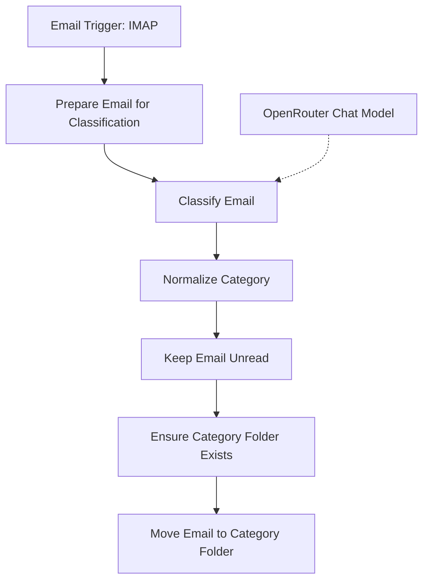

Hey folks,

In my [last post](), I covered using N8N and local large language models to cut down on email notifications. That setup was about deciding which emails deserved my attention straight away. This time, I'm taking the idea a bit further and using an LLM to decide which folder each email should go into.

The main reason behind this is pretty simple. Even if my phone isn't going off all day, I still have an inbox full of newsletters, receipts, automated alerts and things I actually need to do. So this workflow sorts incoming mail into folders, ready for when I want to deal with it.

### How I Set It Up

I'm using Purelymail for the mailbox again, with N8N handling the workflow. For the classification, this version uses OpenRouter, with `openai/gpt-5.4` selected in the supplied configuration.

There are two parts to this really. First, prepare the email and ask the model for a category. Then use that category to move the original email into an IMAP folder.

#### N8N Flow



The folder operations use the [n8n-nodes-imap community node](https://github.com/umanamente/n8n-nodes-imap), which supports creating mailboxes, changing message flags and moving emails. You'll need that installed, along with your IMAP and OpenRouter credentials configured in N8N.

#### Preparing the Email

The workflow starts with the Email Trigger (IMAP), with tracking of the last message ID enabled. The next Code node pulls out the sender, recipient, date, subject and body, along with the IMAP UID we'll need to move the message later.

Where possible, it uses the plain text body. If the email only has HTML, it strips out the tags, styles and scripts and tidies up the whitespace. There's no need to send a whole newsletter's HTML layout just to work out that it's a newsletter.

I've also limited the body to 3,000 characters. That keeps the input smaller, although it does mean the model could miss something important further down a long email. Attachments aren't included in the classification either.

#### Choosing the Categories

Instead of high, medium and low priority, this version asks the model to choose one of twelve categories:

| Category | What it's for |
| --- | --- |
| Urgent | Genuinely time-sensitive emails needing attention soon. |
| Action | Something I need to do, but not necessarily straight away. |
| Waiting For | Updates about something I've asked someone else to do. |
| Delegated | Emails about a task I've assigned to someone else. |
| Scheduled | Something relevant at a particular date or time. |
| Newsletter | Recurring informational content. |
| Notification | Automated alerts and account messages. |
| Receipt | Purchases, invoices, confirmations and bookings. |
| Reference | Useful information that doesn't need any action. |
| Someday/Maybe | Something potentially useful later, without a current commitment. |
| Archive | No action or future relevance, but worth retaining. |
| Trash | Disposable mail. |

These are the categories in the prompt, so you can change them to suit how you organise your own mailbox. Just remember to update the category list and folder mapping in the normalisation node as well.

### Getting the Model to Give a Useful Answer

In the previous setup, getting the model to return the right JSON was a bit of a challenge. Here, all I need back is a category name, so the instruction is simpler:

```text
Reply with ONLY the category name, exactly as written above.
No punctuation, quotes, markdown or explanation.
```

There are also a couple of rules to help steer it. Automated messages from no-reply addresses, monitoring systems or account services should be `Notification`, rather than `Action`. And it should only choose `Waiting For` or `Delegated` when the email clearly relates to something I've handed off.

That first rule is quite broad. An automated account alert can still need urgent attention, so it's something I'd refine with exceptions for the messages I care about. The model also only sees the current email, so it can't reliably know what I've delegated unless the message actually says so.

The model node has temperature set to `0` to reduce variation, but the next step still needs to handle unexpected output.

#### Normalising the Response

The Normalize Category node checks the response against the allowed categories, ignoring case and punctuation. It tries a full match first, then looks for a category name within the response. If nothing matches, it uses `Action`, so the email goes somewhere I need to check.

This is a fallback for an unusable answer, rather than a failed API request. If the model call itself fails, this node won't automatically rescue that execution.

The matching could also be stricter. If the model gives an explanation containing several category names, the code takes the first matching category in its configured list. Accepting only a full match would be a useful improvement.

### Moving the Email

Once we have a category, there are three steps left:

1. **Keep Email Unread**: Set the original message's `\Seen` flag to false. Having an automation look at it shouldn't count as me reading it.
2. **Ensure Category Folder Exists**: Try to create the destination folder. This node continues on error so an existing folder doesn't stop the workflow.
3. **Move Email to Category Folder**: Move the message from `INBOX` using its UID and the mapped folder name.

Most folder names match their category exactly. The exception is `Someday/Maybe`, which maps to `Someday-Maybe` to avoid putting a slash in the folder name.

Continuing on a folder creation error also means other errors can slip past that step, so a failed move still needs checking. And the UID needs to be present in the trigger output; it's how the workflow identifies the original email in `INBOX`.

### What About Local Models?

Privacy was one of the reasons I used a local model in the previous post. This version changes that: the prompt contains email addresses, the subject, date and the trimmed body, and sends them through OpenRouter to the model provider.

So the same privacy benefit doesn't apply here. A local model would be an option for keeping that classification on my own server, with some testing to see how well it follows the category instructions.

### Further Improvements

I'd start with a test mailbox and check where messages end up before relying on it for everyday mail, particularly anything classified as `Trash`. The workflow moves those messages into the Trash folder, where the mail provider's retention settings may apply.

There's also room to add sender rules before the model call, or bring back the NTFY notifications from the previous post for `Urgent` messages. Email content can contain instructions of its own, so another improvement would be to explicitly tell the model to treat the message as content to classify and ignore instructions inside it.

For now, the idea is to take some of the repetitive sorting out of checking email. I still need to read and act on the important bits, but having receipts, newsletters and things to do in separate folders gives me a more useful place to start.

Happy automating,
